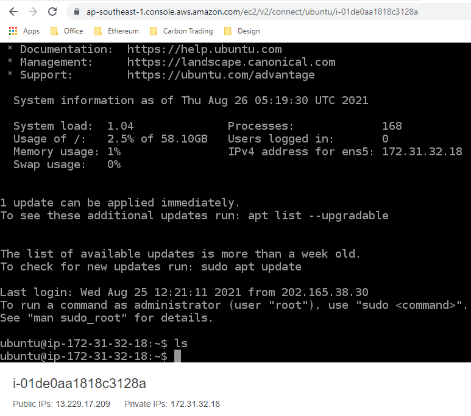
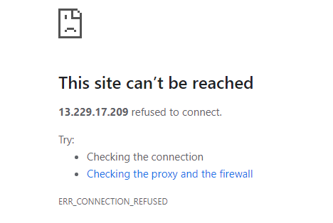
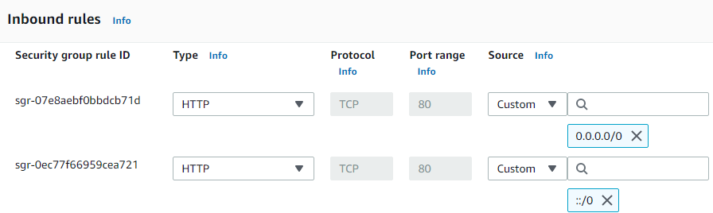
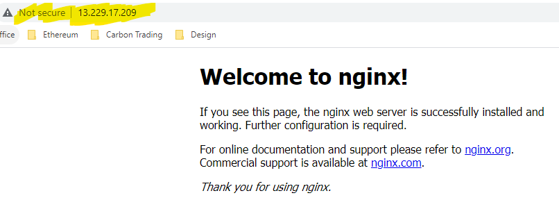
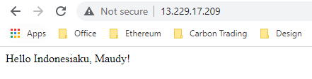

# Belajar Dengan Jenius DevOps

## Author : Gun Gun Febrianza


# AWS EC2 (Elastic Cloud Computing)

Fitur **Amazon** **EC2** :

1. **Virtual Computing Environment**

   Lingkungan untuk melakukan komputasi virtual yang disebut dengan **instance**.

2. **Preconfigured Templates**

   Kita dapat membangun sebuah template untuk **instance** menggunakan **Amazon Machine Images (AMIs)**  

3. **Secure Login Information**

   Sistem untuk melakukan login yang aman, **AWS** akan menyimpan **public-key** dan kita akan menyimpan **private-key** untuk melakukan **login** ke dalam **instance**.

4. **Firewall Configuration**

   Pengaturan **Protocol**, **Ports** dan **Source IP Ranges** yang dapat mengakses **instances** milik kita.

5. **Instance Store Volumes**

   Tempat penyimpanan sementara yang akan dihapus jika perintah **stop**, **hibernate** atau **terminate** dieksekusi pada **instances**. 

6. **Amazon Elastic Block Store (EBS) Integration**

   Tempat penyimpanan permanen menggunakan layanan **Amazon Elastic Block Store (EBS)**.

7. **Amazon Elastic IP Integration** 

   Dukungan penerapan **Static IPv4 Addresses** menggunakan layanan **Amazon Elastic IP**.

8. **Virtual Private Clouds (VPCs)**

   Kita dapat membuat jaringan komputer virtual secara terisolasi.

   

## General Purpose Instance 

## Compute Optimized Instance 

## Memory Optimized Instance 

## Accelerated Computing


# AWS EC2 Dashboard

## Instances 

## Images 

## Elastic Block Store 

## Network & Security 

## Load Balancing 

## Auto Scaling

---


# Example Running Instance

Di bawah ini adalah contoh informasi dari running instance dalam **Amazon EC2** :


|    Instance Info    |                          Value                          | Description |
| :-----------------: | :-----------------------------------------------------: | ----------- |
|        Name         |                 Server A - Development                  |             |
|     Instance ID     |                   i-0d06ceabb68b31c80                   |             |
|   Instance State    |                         Running                         |             |
|    Instance Type    |                       t3a.2xlarge                       |             |
|    Status Check     |                    2/2 Checks Passed                    |             |
|    Alarm Status     |                        No Alarm                         |             |
|  Availability Zone  |                     ap-southeast-1c                     |             |
|   Public IPv4 DNS   | ec2-13-212-226-211.ap-southeast-1.compute.amazonaws.com |             |
| Public IPv4 Address |                     13.212.226.211                      |             |
|     Elastic IP      |                            -                            |             |
|      IPv6 IPs       |                            -                            |             |
|     Monitoring      |                         Enabled                         |             |
|   Security Group    |                     launch-wizard-1                     |             |
|      Key Name       |                      X-Development                      |             |
|     Launch Time     |                 2021/08/25 16:06 GMT+7                  |             |

Terdapat informasi tambahan lainnya :

|    Instance Info     |             Value             |   Description   |
| :------------------: | :---------------------------: | :-------------: |
|        VPC ID        |         vpc-893ee9ef          |                 |
|      Subnet ID       |        subnet-74cdba2d        |                 |
|       IAM Role       | EC2-Call-All-AWS-Services-Gun | Manual Creation |
|       Platform       |            Ubuntu             |                 |
| Credit Specification |           Unlimited           |                 |
| Virtualization Type  |              HVM              |                 |
|   Number of vCPUs    |               8               |                 |
|       Tenancy        |            Default            |                 |

## Storage

### Root Device Details

Dibawah ini adalah informasi **Root Device Details Storage** yang digunakan dari **Running Instance** di atas :

|   Storage Info   |   Value   | Description |
| :--------------: | :-------: | :---------: |
| Root device name | /dev/sda1 |             |
| Root device type |    EBS    |             |
| EBS Optimization |  enabled  |             |

### Block Device Details

|      Storage Info      |                            Value                             | Description |
| :--------------------: | :----------------------------------------------------------: | :---------: |
|          Name          |                                                              |             |
|       Volume ID        |                    vol-00fbee6da3f467e4a                     |             |
|          Size          |                            60 GiB                            |             |
|      Volume Type       |                             gp2                              |             |
|          IOPS          |                             180                              |             |
|       Throughput       |                              -                               |             |
|        Snapshot        |                    snap-0c83907cbff0eb0fb                    |             |
|        Created         |             August 25, 2021 at 4:06:54 PM UTC+7              |             |
|   Availability Zone    |                       ap-southeast-1c                        |             |
|         State          |                            in-use                            |             |
|      Alarm Status      |                            *None*                            |             |
| Attachment Information | [i-0d06ceabb68b31c80 (Server A - Development)](https://ap-southeast-1.console.aws.amazon.com/ec2/v2/home?region=ap-southeast-1#Instances:search=i-0d06ceabb68b31c80;sort=instanceId):/dev/sda1 (attached) |             |
|       Monitoring       |                                                              |             |
|     Volume Status      |                                                              |             |
|       Encryption       |                        Not Encrypted                         |             |
|       KMS Key ID       |                                                              |             |
|  Multi-attach Enabled  |                              No                              |             |


----


# Quick Start EC2


## Browser-based SSH Connection

Dalam **Dashboard EC2** kita dapat login ke dalam **server** menggunakan **browser-based SSH Connection** :


Di bawah ini adalah gambar saat kita sudah terhubung dengan **instances** yang kita miliki :




## Putty


# Nginx

Kita akan melakukan instalasi **nginx**, eksekusi perintah di bawah ini :

```bash
~$ sudo apt-get update
~$ sudo apt-get install nginx
```

Untuk menjalankan **Nginx** eksekusi perintah berikut :

```
~$ sudo /etc/init.d/nginx start
	Starting nginx (via systemctl): nginx.service.
```

Untuk memastikan **nginx** berjalan dengan benar eksekusi perintah di bawah ini :

```
~$ sudo systemctl status nginx
```

Perintah di atas akan memproduksi **output** sebagai berikut :

```
● nginx.service - A high performance web server and a reverse proxy server
     Loaded: loaded (/lib/systemd/system/nginx.service; enabled; vendor preset: enabled)
     Active: active (running) since Thu 2021-08-26 05:40:44 UTC; 3min 19s ago
       Docs: man:nginx(8)
   Main PID: 15321 (nginx)
      Tasks: 9 (limit: 38102)
     Memory: 11.1M
     CGroup: /system.slice/nginx.service
             ├─15321 nginx: master process /usr/sbin/nginx -g daemon on; master_process on;
             ├─15322 nginx: worker process
             ├─15323 nginx: worker process
             ├─15324 nginx: worker process
             ├─15325 nginx: worker process
             ├─15326 nginx: worker process
             ├─15327 nginx: worker process
             ├─15328 nginx: worker process
             └─15329 nginx: worker process

Aug 26 05:40:44 ip-172-31-32-18 systemd[1]: Starting A high performance web server and a reverse proxy server...
Aug 26 05:40:44 ip-172-31-32-18 systemd[1]: Started A high performance web server and a reverse proxy server.
```

----------


## Install net-tools

Intall **net-tools** dengan mengeksekusi perintah di bawah ini :

```bash
~$ sudo apt install net-tools
```

Setelah itu eksekusi perintah di bawah ini :

```bash
~$ sudo netstat -ntlp
```

Perintah di atas akan memproduksi output :

```
Active Internet connections (only servers)
Proto Recv-Q Send-Q Local Address           Foreign Address         State       PID/Program name    
tcp        0      0 0.0.0.0:22              0.0.0.0:*               LISTEN      753/sshd: /usr/sbin 
tcp        0      0 0.0.0.0:80              0.0.0.0:*               LISTEN      15321/nginx: master 
tcp        0      0 127.0.0.53:53           0.0.0.0:*               LISTEN      445/systemd-resolve 
tcp6       0      0 :::22                   :::*                    LISTEN      753/sshd: /usr/sbin 
tcp6       0      0 :::80                   :::*                    LISTEN      15321/nginx: master 
```

Jika kita mencoba akses **IP Server** kita maka hasilnya akan gagal :

http://13.229.17.209/



Solusinya kita harus melakukan konfigurasi **Firewall** yang kita miliki melalui **Security Group**.

------


## Setup HTTP Inbound Rules

Pada **Dashboard EC2** pilih **menu Security Group**, pada **security group** yang kita gunakan pilih **Edit Inbound Rules**. Selanjutnya tambahkan **HTTP** :



Selanjutnya jika kita mencoba akses **IP Server** kita maka hasilnya akan berhasil :



Jika kita ingin mengubah tampilan halaman depan website, ikuti langkah berikut :

Pertama kita harus menjadi root terlebih dahulu :

```bash
~$ sudo -s
```

Selanjutnya kita akan berpindah directory :

```bash
~$ cd /var/www/html
```

Eksekusi perintah di bawah ini :

```bash
 ~$ echo "Hello Indonesiaku, Maudy!" > index.nginx-debian.html
```

Kemudian restart nginx :

```bash
~$ systemctl restart nginx
```

Kita coba akses **IP Server** kita



----

## Cheatsheet

Untuk memeriksa status **nginx** eksekusi perintah di bawah ini :

```bash
~$ sudo systemctl status nginx
```

Untuk menambahkan **nginx** agar otomatis berjalan saat **start up** eksekusi perintah berikut :

```bash
~$ sudo systemctl enable nginx
```

Untuk menghentikan **nginx** eksekusi perintah di bawah ini :

```bash
~$ sudo systemctl stop nginx
```

Untuk menjalankan **nginx** eksekusi perintah di bawah ini :

```bash
~$ sudo systemctl start nginx
```


# [EC2 API Reference](https://docs.aws.amazon.com/AWSEC2/latest/APIReference/Welcome.html)


# [EC2 Auto Scaling API Reference](https://docs.aws.amazon.com/autoscaling/ec2/APIReference/Welcome.html) 

